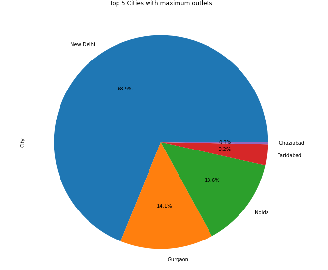
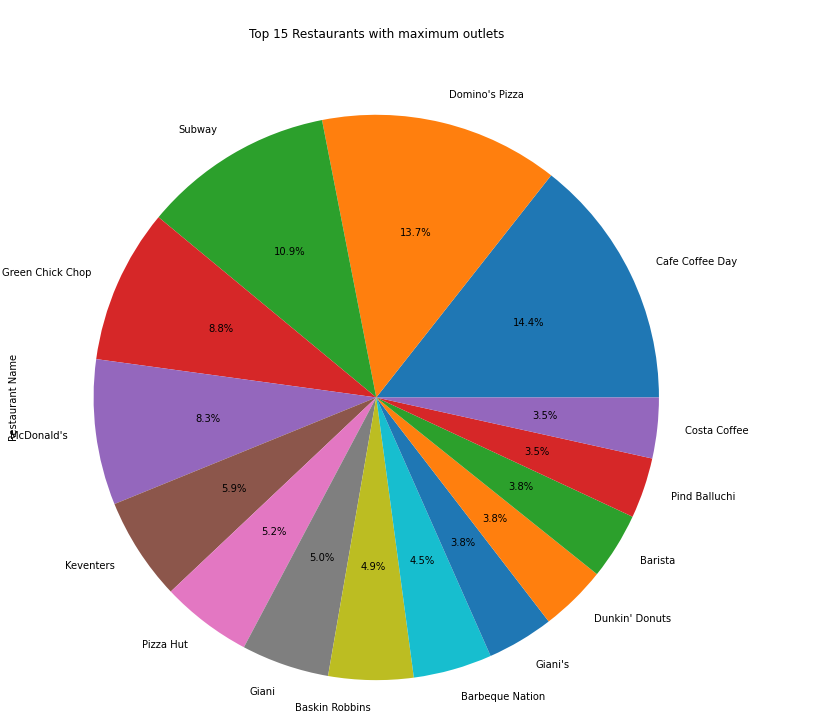
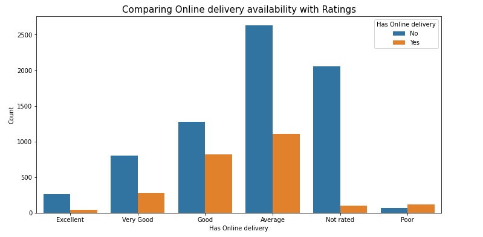
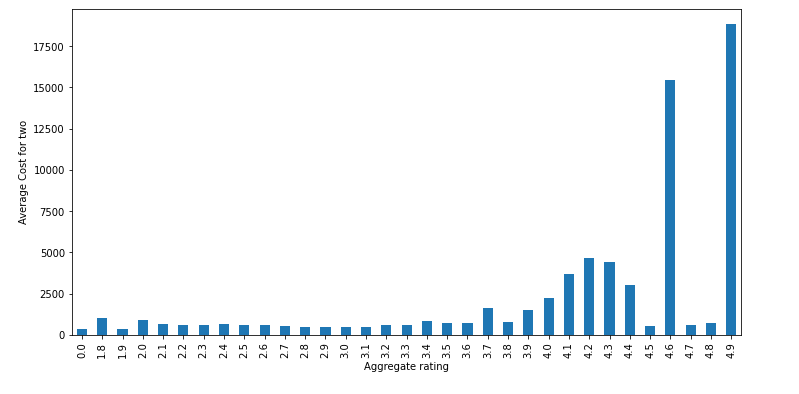
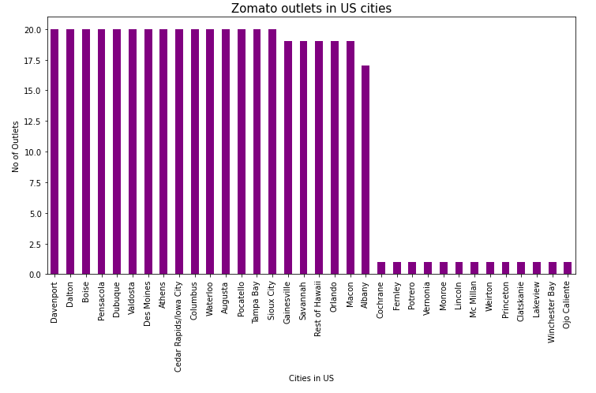

# Zomato EDA

## Introduction
The dataset is about Zomato restaurants. It is taken from Kaggle, where data has been collected from the Zomato API.

The data has been stored in the Comma Separated Value file Zomato.csv. Each restaurant in the dataset is uniquely identified by its Restaurant Id. Every Restaurant contains the following variables.

• Restaurant Id : Unique id of every restaurant across various cities of the world

• Restaurant Name : Name of the restaurant

• Country Code : Country in which restaurant is located

• City : City in which restaurant is located

• Address : Address of the restaurant

• Locality : Location in the city

• Locality Verbose : Detailed description of the locality

• Longitude : Longitude coordinate of the restaurant's location

• Latitude : Latitude coordinate of the restaurant's location

• Cuisines : Cuisines offered by the restaurant

• Average Cost for two: Cost for two people in different currencies

• Currency : Currency of the country

• Has Table booking : yes/no

• Has Online delivery : yes/ no

• Is delivering : yes/ no

• Switch to order menu: yes/no

• Price range : range of price of food

• Aggregate Rating : Average rating out of 5

• Rating color : depending upon the average rating color

• Rating text : text on the basis of rating of rating

• Votes : Number of ratings casted by people

We also have another datset with country_code and country name as seperate csv file which is also used in this notebook.

## About the company

"Zomato" is an Indian multinational restaurant aggregator and food delivery company founded by Deepinder Goyal and Pankaj Chaddah in 2008.

Zomato provides information, menus and user-reviews of restaurants as well as food delivery options from partner restaurants in select cities.

Launched in 2010, their technology platform connects customers, restaurant partners and delivery partners, serving their multiple needs. Customers use the platform to search and discover restaurants, read and write customer generated reviews and view and upload photos, order food delivery, book a table and make payments while dining-out at restaurants.

On the other hand, they provide restaurant partners with industry-specific marketing tools which enable them to engage and acquire customers to grow their business while also providing a reliable and efficient last mile delivery service.

They also operate a one-stop procurement solution, Hyperpure, which supplies high quality ingredients and kitchen products to restaurant partners.They provide their delivery partners with transparent and flexible earning opportunities.
Exploratory Data Analysis on Zomato Restaurants

## Questions to be answered through analysis

The following are the question to be analysed.

Q1. How many countries do zomato provide their service? In which countries they have maximum transactions?

Q2. How many cities from each country have Zomato service? Which are the top 5 cities with maximum outlets?

Q3. Which are the cities that have only one restaurant partnered with zomato and to which country they belong?

Q4. In which countries most of the restaurants have good ratings?

Q5. Which are the popular cuisines that were assessed excellent? And which cusines were assessed poor mostly?

Q6. Which are the top 15 restaurants with maximum outlets? And in which cities these outlets are more?

Q7. Name the popular restaurants with respect to ratings?

Q8. Does Online delivery option and Table booking option impact customer satisfaction?

Q9. Does cost have impact on ratings?

Q10. Which are the most expensive zomato partnered restaurants around the world and to which cities they belong?

Q11. How do we improve business in US and UK since these countries have the most transaction next to India?

Q12. Why the transactions are less in Canada ?

Q13. In Australia more number of cities have zomato service still the transaction is less. What is the reason and how can it be improved?

Q14. How transactions in Qatar can be increased ?

## Preliminary EDA

1. Zomato provides its service in 15 countries.

2. Most of the transaction of Zomato are in India, where its service is available in 43 cities.

3. Second most transcation of Zomato is from United States, where the service is available in 35 cities.

4. Third most transaction of Zomato is from United Kingdom, but their service is availble only in 4 cities in Uk. However, the number of transaction in India is very high compared to US and Uk and the number are not any close. This is because Zomato is  a Indian based company and is more popula in India.

5. There are around 46 cities from the above listed 15 countries, that have only one zomato serving restaurant in each city.They belong to Australia, Canada, India, Indonesia, Phillipines, South Africa and United States. By increasing the number of outlets per city will help increase the transaction in these countries.

6. Least transction of Zomato is from Canada.This may be because zomato provides its service in only 4 cities and each city has only one zomato restaurant. Zomato can start with the cities that they already provide service and increase the number of restaurants in these cities. Later can expand to different cities in Canda for more transactions.

7. From the dataset its clear that Online delivery option did not have impact on good ratings. Excellent, Good and Average rating counts are higher for restaurants who do not provide online delivery service. And count of restaurants rated poor are compartively less in restaurants that do not provide online service. This may be because most of the time Zomato is used to serach for good restaurant to "Dine in" and have given ratings for those restaurants.

8. Table booking option also donot have impact on rating counts. This may be because people prefer walk in and enjoy their food rather booking table in advance.

9. Zomato can also improve its transaction in countries by connecting with restaurants that provide popular cuisines in specific countries. From the data we saw specific cuisines were rated well.
Like in US - connecting with restaurants having cuisines like American, BBQ, Italian, Asian ,Sandwich and Seafood could increse the transcation.
In Uk providing American, British, Indian, Burger, Chinese, Italian and cafes cuisines will help. 
In canada cuisines like Italian, pizza, Mediteran, chinese, asian and sushi are most preferred.

10. In Qatar, zomato service provides less cuisine option. Incresing the number of cuisines and restaurants will help with the transaction.

11. Zomato is connected with many Indian cusines restaurants around the world where they have good ratings too.

12. Since popularity of zomato helps in more transcation in India Zomato has to break ground in other markets by advertising and partnering with well established restaurants.

13. Restaurants providing Dine in service are rated high and good, so giving offers on dine in would also help improve the business

14. Having revenue per year details for each restaurant would have helped to analyse the transaction better. Also would have helped in taking decisions with connecting and investing in more restaurants.
